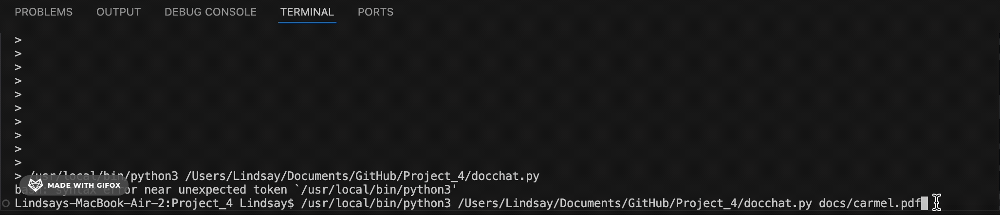

# Project 4: Docchat - Chat with Your Documents! 


This Python program allows users have conversational interactions with their documents using a large language model (LLM). It creates an engaging and responsive chatbot that answers user questions using retrieval-augmented generation (RAG) on local or web-based documents.


## Demo



## Code Examples 

How to run my code:
```
$ python3 Project_4/docchat.py docs/carmel.pdf
```


**1. Program answers this question well:**
```
docchat> Please provide a summary of the best activities to do in Carmel for families.
```
```
result= Here is a summary of the best activities to do in Carmel for families: Carmel, California, is a great destination for families with plenty of activities to enjoy together. One of the top recommendations is to visit Point Lobos State Natural Reserve to catch a glimpse of migrating whales. Families can also stop at Dutch Door Donuts and enjoy a sweet treat at Carmel Beach, which is dog-friendly and a great spot for a family outing. As for the user's question, the article highlights whale watching and beach activities as great options for families to enjoy together in Carmel.
```

**2. Program answers this question poorly:**
```
docchat> What is the cheapest place to stay?
```
```
result= According to the document, the cheapest place to stay in Carmel is not explicitly mentioned, but it does highlight the charm and uniqueness of the area's bed and breakfasts, like the Running Iron Restaurant, which may offer affordable and cozy accommodations. Additionally, the document mentions the village's unique shops, galleries, and restaurants, so visitors may want to explore these options for budget-friendly stay and eats.
```
Although in the "Where to stay" section, the article does lists a number of hotels and other accomodations with their nightly rates, this program has a difficult time evaluating the many numbers and answering a question that doesn't explicitly state the word "cheapest." 
<br></br>

## Language Capabilities

This program support asking questions in English when the document is non-English.
```
$ python3 Project_4/docchat.py docs/carmel_spanish.txt
```
```
docchat> Please summarize the article.
```
```
result= Here is a summary of the document in three clear and concise sentences: Carmel, California is a charming coastal town on the Monterey Peninsula that attracts artists, writers, and bohemians with its natural beauty, including the Pacific Ocean, Santa Lucia Mountains, and white sand beaches. The town has a rich cultural scene with numerous art galleries, museums, and restaurants, and is also home to Carmel-by-the-Sea, a picturesque village with unique shops and historic landmarks. The surrounding area offers a range of outdoor activities, including hiking, biking, and birdwatching, and is also home to several award-winning restaurants and wineries.
```